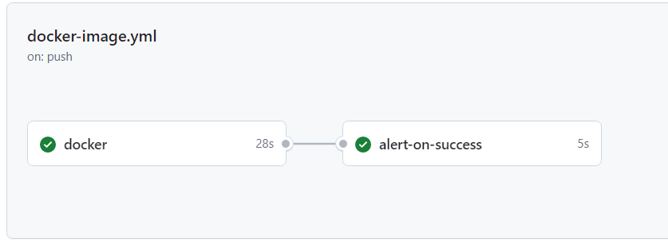
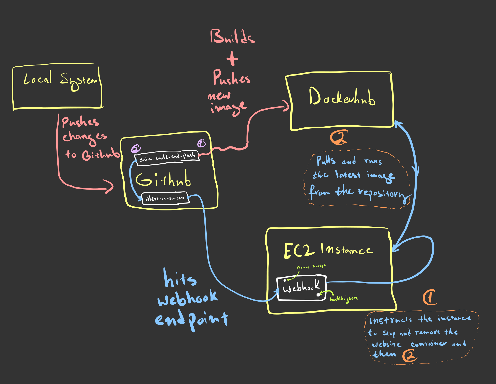
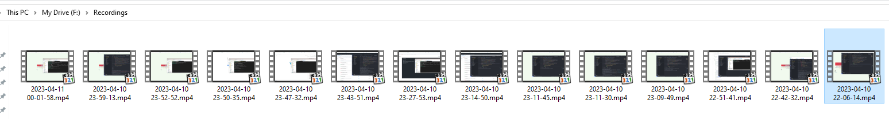

# Project 5

- Image used: [ubuntu/apache2](https://hub.docker.com/r/ubuntu/apache2)

# Project Overview

- Continuos Deployment is the second part of the CI/CD process that deals with automating deployment of software/packages.
  - I will be utilizing github actions to push the latest images to dockerhub in the first job, then the second job will use a webhook that is listening on an AWS EC2 instance to inform it that there's been a new update for the image. The webhook will run a script that stops, removes, pulls the image from Dockerhub, and then runs it in the instance.
  - With this workflow, I can focus on just making changes to my website, and my automation will take care of the deployment and updating aspect.

# Tags

- Tag creation: After a commit has been made, create a new tag using: `git add v1.0.0`.
- Tag pushing: Then, to push the tag we just created, we'll use the command `git push origin v1.0.0`

- Workflow:

  1. Workflow triggers only on tag pushes with major, minor, and patch. `v#.#.#`
  2. On trigger, the workflow builds and pushes a new image to the dockerhub repository using the tags provided.
  3. On succesful completion of the docker build and push, alerts the webhook.

- Docker repo link: [aliAljaffer/ceg3120_project4](https://hub.docker.com/repository/docker/alialjaffer/ceg3120_project4/general)

# Deployment

- [How to install Docker on a Linux system](https://docs.docker.com/engine/install/ubuntu/#install-using-the-repository)

- The restart script names an image `ali-website`. It first tries to stop the image, then remove it, then pulls the latest version and finally runs it.

  - Script should be located in `/home/ubuntu/P5/`
  - [Script](deployment/rstrt.sh)

- Webhook:

  - `sudo apt install webhook`
  - `webhook -hooks /etc/webhook.conf`

- Webhook as a service:

  - Created a `webhook.service` file to make sure the webhook starts with the system on startup. Moved the file to `/etc/systemd/system/` since that's where the default .service files are located at.

- Hook definition file:
  - `id` -> Helps us identify which webhook to trigger. `URL/hooks/id`
  - `execute-command` -> the script file to run on trigger
  - [hooks.json](deployment/hooks.json)

## Documentation

- how to configure GH to message listener
  - My webhook URL is in my github secrets, and I invoke it sequentially in the Action after the docker job is successfully completed.

# Diagramming

[PDF File](imgs/doodle.pdf)

## Debugging is sooo fun!

All my failed attempts at recording a successful run! :)

