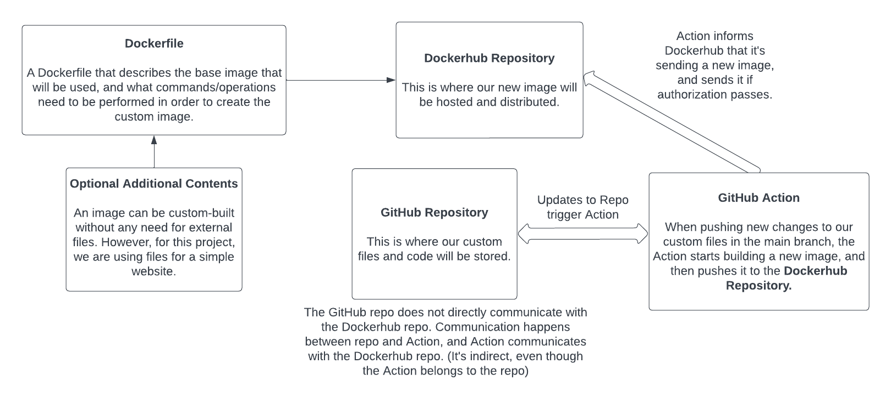

# Project 4

- Image used: [ubuntu/apache2](https://hub.docker.com/r/ubuntu/apache2)

# Project Overview

- The point of this project is to familiarize ourselves with Docker containers and GitHub actions. Containers are isolated filesystems that can run on their own to perform a certain task. For this project, that task is to run an apache2 server for a website.

- Part 4 - Diagramming goes here
  

# Run Project Locally

- `sudo apt install -y docker`
- `docker build -t alialjaffer/ceg3120_project4 .`
- `docker run -it -p 1551:80 --name test alialjaffer/ceg3120_project4:0.1`
- - On a Linux host system, I was getting SIGWINCH when running with the -t flag which terminates the process. If it happens, just run without it.
- `localhost:1551`

# DockerHub

- Process to create public repo in DockerHub
  1.  Headed to Dockerhub
  2.  Clicked on `Repositories`
  3.  Clicked on `Create repository`
  4.  Picked a name and set it to public.
- `docker login`
  - Personally, I created an access token from the website and used that to authenticate.
- `docker push alialjaffer/ceg3120_project4:latest`

# GitHub Actions

- Configuring GitHub Secrets
  - DOCKER_USERNAME -> dockerhub username
  - DOCKER_PASSWORD -> dockerhub password
- Behavior of GitHub workflow
  - On the event of `push` to the `main` branch, the workflow runs, setting up QEMU, Docker Buildx, and then logging into Dockerhub using the provided account credentials in GitHub Secrets. After logging in, the image will be built and (on successful build) will be pushed to the Dockerhub repo.
  - the entire `.yml` file can be used by anyone, but the secrets needed to actually login and push the image are custom to me.
